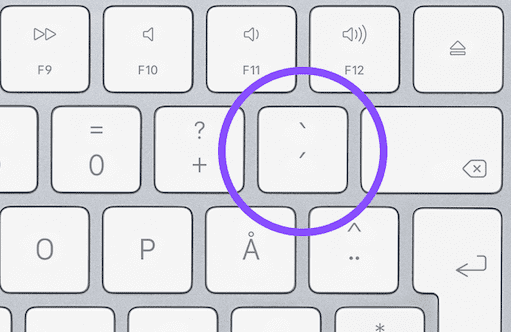
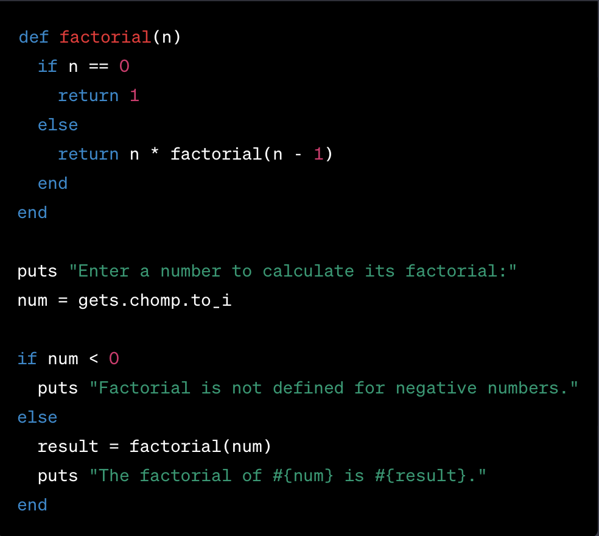
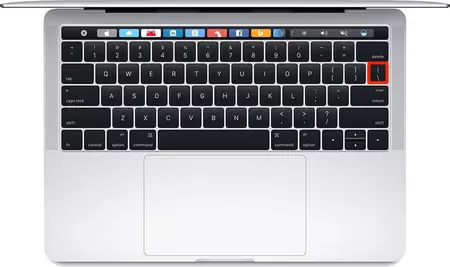

# Writing Good Documenation
## Step 1 - Using Codeblocks.

Codeblock in markdown make it *very easy* for tech people to **copy, paste, share** code.
A good __Cloud Engineer__ uses Codeblocks whenever possible.

Because it allow others to copy and paste their code to replicate or research issues.

- In order to create codeblocks in markdown you to use three backticks (```)
- No to be confused with qoutation (') [<sub>[1]</sub>](#references)


```
def factorial(n)
  if n == 0
    return 1
  else
    return n * factorial(n - 1)
  end
end

puts "Enter a number to calculate its factorial:"
num = gets.chomp.to_i

if num < 0
  puts "Factorial is not defined for negative numbers."
else
  result = factorial(num)
  puts "The factorial of #{num} is #{result}."
end
```

- When you can you should attem to applu syntax highlighting your codeblocks

```ruby
def factorial(n)
  if n == 0
    return 1
  else
    return n * factorial(n - 1)
  end
end

puts "Enter a number to calculate its factorial:"
num = gets.chomp.to_i

if num < 0
  puts "Factorial is not defined for negative numbers."
else
  result = factorial(num)
  puts "The factorial of #{num} is #{result}."
end
```
- Make not of where the backtick button is located.
- It should appear above the tab key, but may vary based on your keyboard layout. 



Good Cloud Engineers use codeblcoks for both code and errors that appear in the console.

```bash
irb(main):001:0> x = 10 / 0
Traceback (most recent call last):
        2: from /usr/bin/irb:11:in `<main>'
        1: from (irb):1
ZeroDivisionError (divided by 0)
```
> Here is an example of using a codeblock for an error that appear in bash.

When you can always provide a codeblock instead of a screenshot.
If you need to take a screenshote make sure its not a photo from your phone

> There are certain cases where its okay to take photos with your phone. This only acceptable is not something from youre computerscreen. 

## Step 2 - How to take screenshots

A screen shot is when you capture a part of your screen from your laptop, desktop or phone.
this is not to be confused with take a photo with your phone. 
**DONT'T DO THIS**


** DO THIS INSTEAD **



This is what a screen shot from you computer should look like

To take screenshots on both Mac and Windows, you can use keyboard shortcuts. Here are the common hotkeys for taking screenshots on both operating systems:

**For Mac:**

1. **Capture Entire Screen:**
   - Press `Shift + Command + 3` simultaneously. This will capture the entire screen and save it as a file on your desktop by default.

2. **Capture a Selected Portion of the Screen:**
   - Press `Shift + Command + 4`, then click and drag to select the portion of the screen you want to capture. Release the mouse button to take the screenshot.

3. **Capture a Specific Window:**
   - Press `Shift + Command + 4`, then press the `Spacebar`. The cursor will change to a camera icon. Click on the window you want to capture. This will capture the selected window and save it as a file.

4. **Capture the Touch Bar (if applicable):**
   - Press `Shift + Command + 6` to capture the Touch Bar on MacBook Pro models with a Touch Bar.

5. **Screenshots are saved by default to your desktop.**

**For Windows:**

1. **Capture the Entire Screen:**
   - Press `PrtScn` (Print Screen) key. The screenshot is copied to your clipboard.

2. **Capture the Active Window:**
   - Press `Alt + PrtScn`. This captures only the currently active window and copies it to your clipboard.

3. **Capture a Selected Portion of the Screen (Windows 10 and later):**
   - Press `Windows + Shift + S`. This will open the Snip & Sketch tool, allowing you to select and capture a portion of the screen. The screenshot is copied to your clipboard.

4. **Capture a Specific Window (Windows 10 and later):**
   - Press `Alt + PrtScn`. This captures the currently active window and copies it to your clipboard.

5. **Use the Snipping Tool (Windows 7 and 8):**
   - Search for "Snipping Tool" in the Start menu, open it, and use the tool to capture and annotate screenshots.

6. **Use Snip & Sketch (Windows 10 and later):**
   - Search for "Snip & Sketch" in the Start menu, open it, and use the tool to capture and annotate screenshots.

7. **Screenshots taken with `PrtScn` or `Windows + Shift + S` are copied to the clipboard. You can paste them into an image editor or document (e.g., Microsoft Paint, Word, or a graphics program) to save or edit them.**

Please note that the specific key combinations and methods might vary depending on your Mac or Windows version. These are general shortcuts for recent versions of each operating system, but older versions might have slightly different methods or require third-party software for advanced screenshot features.

## Step 3 - Use Github Flavoured Markdown Task Lists 

Github extens Markdown to have a list where you can check off items.<sub>[3]</sub>

- [x] Finish Step 1
- [x] Finish Step 2
- [ ] Finish Step 3

# Step 4 - Using Emojis (Optional)

GitHub Flavored Markdown GFM supports emoji shortcodes
Here are some examples:
| Name | Shortcode | Emoji |
|-------|--------|-------|
| Cloud | `:cloud:` | :cloud: |
| Cloud with lightning | `:cloud_with_lightning:` | :cloud_with_lightning: |
| Milky Way | `:milky_way:` | :milky_way: |

# Step 5 how to create a table

You can use the following markdown format to create tables:

```md
| Name | Shortcode | Emoji |
|-------|--------|-------|
| Cloud | `:cloud:` | :cloud: |
| Cloud with lightning | `:cloud_with_lightning:` | :cloud_with_lightning: |
| Milky Way | `:milky_way:` | :milky_way: |
```
Github extens the functionality of Markdown tables to provide more alignment and table cell formatting options.[<sub>[4]</sub>](#references)



[Secret Window Hidden Garden](secret-window/hidden-garden.md)

## References 
- [Basic writing and formatting syntax
](https://docs.github.com/en/get-started/writing-on-github/getting-started-with-writing-and-formatting-on-github/basic-writing-and-formatting-syntax) <sub>[1]</sub>
- [Headings](https://docs.github.com/en/get-started/writing-on-github/getting-started-with-writing-and-formatting-on-github/basic-writing-and-formatting-syntax#headings) <sub>[2]</sub>
- [GFM - Wrting](https://docs.github.com/en/get-started/writing-on-github/getting-started-with-writing-and-formatting-on-github/basic-writing-and-formatting-syntax#quoting-text) <sub>[3]</sub>
- [GFM - Emoji Cheatsheet]([thub/getting-started-with-writing-and-formatting-on-github/basic-writing-and-formatting-syntax#using-emoji](https://github.com/ikatyang/emoji-cheat-sheet/blob/master/README.md)https://github.com/ikatyang/emoji-cheat-sheet/blob/master/README.md)
- [GFM - Tabels (with extentions)](https://github.github.com/gfm/#tables-extension-) <sub>[4]</sub>
